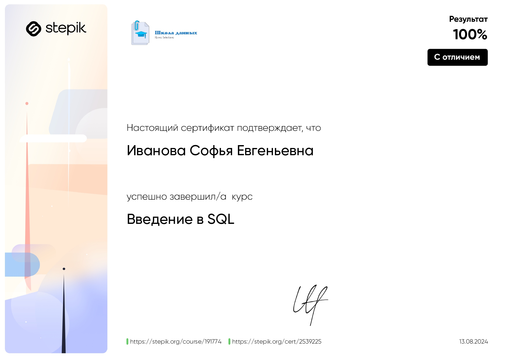
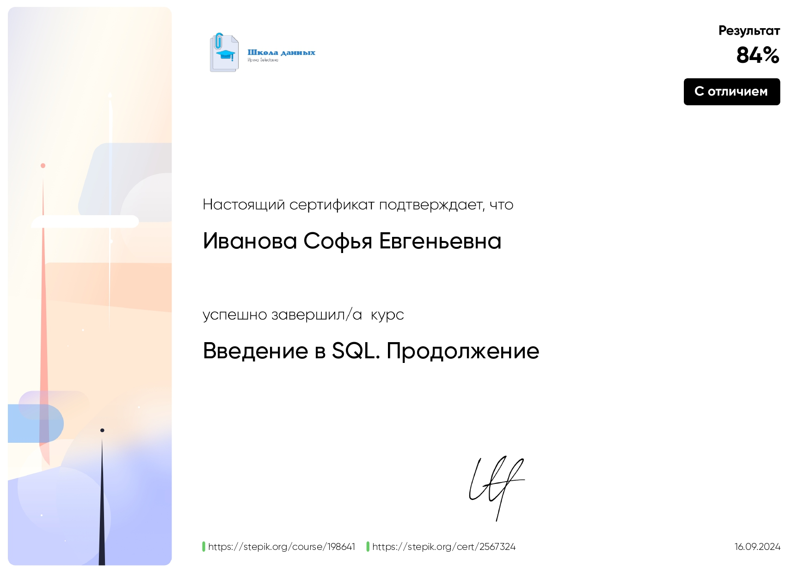

# 📚 Обзор курсов по анализу данных и SQL  

## 📊 Базовый курс по анализу данных  

**Автор:** "Т-Образование"  

**Дата:** июль-август 2024 г.  

### Программа курса  

1. **Компании и продукты** – цели и задачи бизнеса, жизненный цикл ПО.  
2. **Python** – основные операции, типы и переменные, циклы, функции и библиотеки, Pandas.  
3. **Excel** – работа с таблицами и функциями.  
4. **Визуализация** – построение диаграмм в Excel и Python.  
5. **Метрики** – количественные и пользовательские, относительные и операционные, сложные метрики, сегментации и когорты.  
6. **Математическая статистика и A/B тесты**  
7. **Выводы из данных** – когнитивные искажения, введение в юнит-экономику.  

  

---

## 🛠 Введение в SQL  

**Автор:** Ирина Selectoвна (stepic.org)  

### Опыт  

- Ведущий разработчик в крупном банке  
- Сертификат **1Z0-047-ENU: Oracle Database SQL Expert**  
- Более 10 лет работы с хранилищами данных банков и телеком-компаний  

**Дата:** август 2024 г.  

### Программа курса  

- Соединения таблиц  
- Подзапросы  
- Объединения таблиц  
- Представления и CTE  
- Оконные функции  
- Функции IF, CASE и работа с NULL  

  

---

## 🛠 Введение в SQL. Продолжение  

**Автор:** Ирина Selectoвна (stepic.org)  

### Опыт  

- Ведущий разработчик в крупном банке  
- Сертификат **1Z0-047-ENU: Oracle Database SQL Expert**  
- Более 10 лет работы с хранилищами данных банков и телеком-компаний  

**Дата:** август 2024 г.  

### Программа курса  

- Оптимизация SQL-запросов  
- Индексы и их использование  
- Разбор сложных аналитических запросов  
- Хранимые процедуры и триггеры  
- Работа с большими объемами данных  

